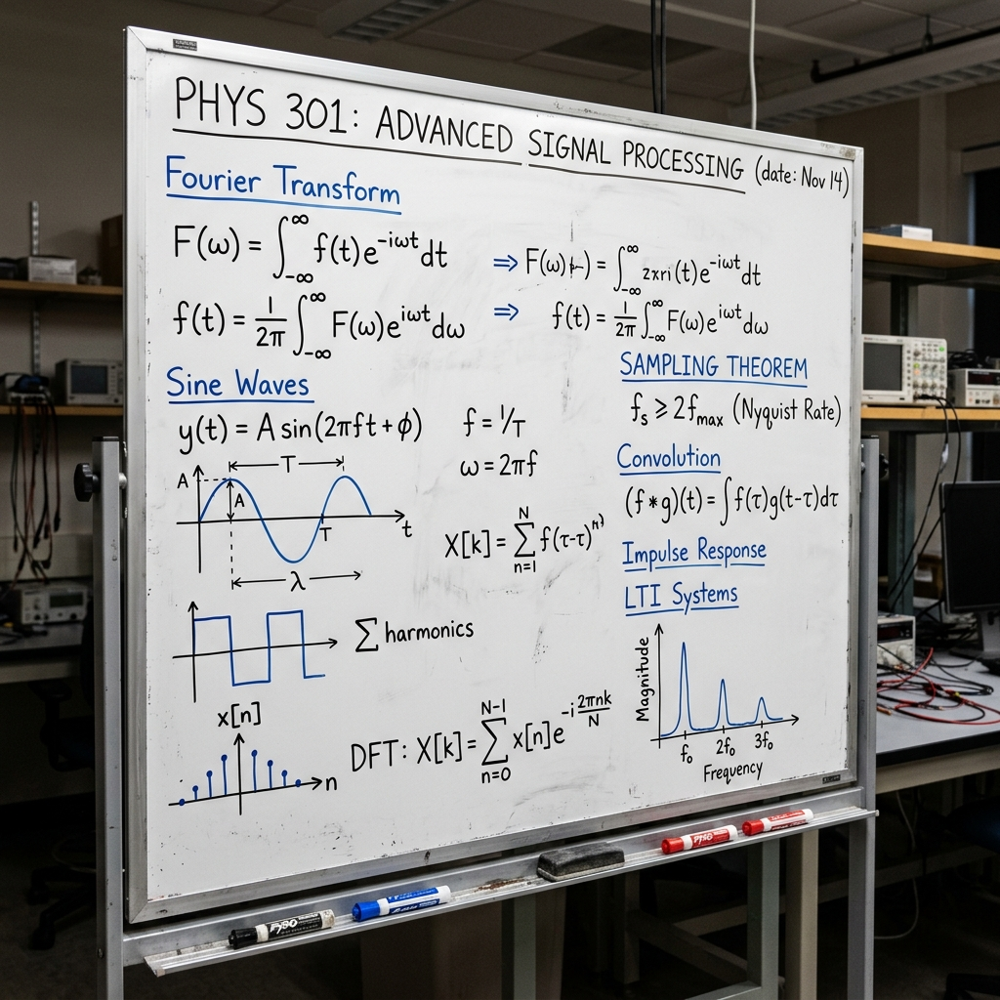

# SignalForge 3D 🌊🔬



**SignalForge 3D** is a next-generation, highly immersive virtual physics and engineering laboratory built with cutting-edge web technologies. Designed to bring 2D virtual labs into the modern era, SignalForge allows students, educators, and engineers to physically interact with laboratory equipment in a fully realized 3D environment right from their web browser.

No downloads, no installations—just pure, interactive signal processing.

---

## 🚀 Key Features

- **Photorealistic 3D Environment**: Step into a meticulously designed physics lab complete with a polished concrete floor, enclosed walls, dynamic lighting, and framed portraits of signal processing pioneers like Joseph Fourier and Harry Nyquist.
- **Physical Equipment Interaction**: Interact with highly detailed 3D models of standard lab equipment. Click and drag the knobs on the dual Function Generators to watch the parameters change in real-time.
- **Real-Time Oscilloscope Rendering**: View your waveforms on a realistic CRT oscilloscope screen that updates instantly as you tweak signal frequencies, amplitudes, and phases.
- **Modern React UI Overlay**: A sleek, glassmorphic UI overlay (built with Tailwind CSS) provides precise control over the environment and allows you to seamlessly switch between complex lab tasks.
- **Comprehensive Signal Tasks**:
  - **Signal Plot**: Visualize standard continuous and discrete signals (Sine, Unit Step, Impulse, Ramp, Exponential).
  - **Signal Product**: Hook up two function generators simultaneously and watch the oscilloscope render their mathematical product in real-time.
  - **Real & Complex Sinusoids**: Explore advanced waveform behaviors.
  - **Haar Wavelet & Orthogonality**: Conduct advanced experiments usually reserved for physical university labs.

---

## 🛠️ Technology Stack

SignalForge 3D leverages a modern web stack to deliver a high-performance 60FPS 3D experience without sacrificing UI flexibility:

- **Framework**: [Next.js (React)](https://nextjs.org/) for robust frontend architecture and state management.
- **3D Engine**: [Babylon.js](https://www.babylonjs.com/) for unparalleled WebGL rendering, physics, and hardware interaction.
- **Styling**: [Tailwind CSS](https://tailwindcss.com/) for the modern, responsive glassmorphism UI overlay.
- **Language**: TypeScript for strict typing and reliable engine logic.

---

## 💻 Getting Started

To run SignalForge 3D locally on your machine, follow these steps:

### Prerequisites
Make sure you have [Node.js](https://nodejs.org/) (v18+) and npm installed.

### Installation

1. **Clone the repository** (or download the source):
   ```bash
   git clone https://github.com/Varun072006/Signalforge-3D.git
   cd signalforge-3d
   ```

2. **Install dependencies**:
   ```bash
   npm install
   ```

3. **Start the development server**:
   ```bash
   npm run dev
   ```

4. **Enter the Lab**:
   Open your browser and navigate to [http://localhost:3000](http://localhost:3000).

---

## 🎮 How to Use the Lab

1. **Navigate the Room**: Click and drag on any empty space in the 3D canvas to orbit the camera. Scroll to zoom in and out.
2. **Focus the Oscilloscope**: Press the `F` key on your keyboard at any time to instantly focus the camera directly on the Oscilloscope screen.
3. **Change Tasks**: Use the top navigation bar to switch between experiments (e.g., Signal Plot vs. Signal Product).
4. **Interact with Hardware**: Hover your mouse over the dark knobs on the Function Generators. When your cursor turns into a hand, click and drag **up or down** to physically rotate the knob and change the signal's Frequency, Amplitude, or Phase.
5. **UI Controls**: Alternatively, use the sleek left-side UI panel to input exact numerical values for your signals.

---

## 🧪 Architecture Overview

The core logic of SignalForge is decoupled from the UI, ensuring smooth communication between React and Babylon.js:

- **`signalState.ts`**: A singleton reactive state manager. Both the React UI and the Babylon render loop subscribe to this state, ensuring 100% synchronization between UI inputs and physical knob rotations.
- **`signalEngine.ts`**: The mathematical brain behind the lab. It computes complex waveforms, generates equation strings, and parses signal types on the fly.
- **`equipmentBuilder.ts` & `labEnvironment.ts`**: Procedurally generates the highly detailed lab room, lighting, textures, and interactive physical hardware.
- **`knobInteraction.ts`**: Handles the complex pointer math required to translate 2D mouse drags into 3D rotational mechanics for the equipment.

---

## 🤝 Contributing

Contributions, issues, and feature requests are welcome! 
Feel free to check out the [issues page](../../issues) if you want to contribute.

## 📝 License

This project is licensed under the MIT License.
